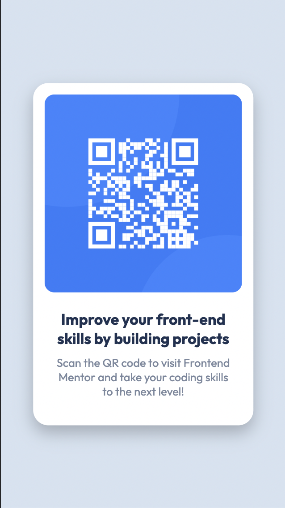
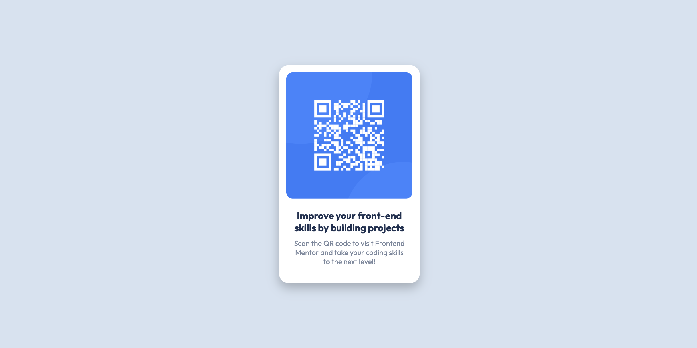

# Frontend Mentor - QR code component

---

## Table of Content

* [Useful Links](#useful-links)
* [Mobile version](#mobile)
* [Desktop version](#desktop)

---

### Useful Links 

* [FM - QR code component](https://www.frontendmentor.io/challenges/qr-code-component-iux_sIO_H)

* [Vercel: My Solution](https://fm-01-qr-code.vercel.app/)

--- 
### Mobile version 

--- 
### Desktop version 

